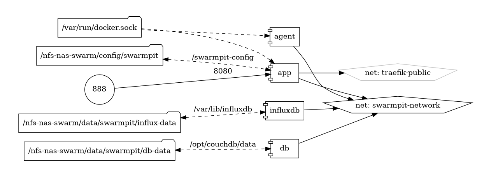

# Swarmpit

Simplifying Docker Swarm Management

{ loading=lazy }

[Swarmpit](https://swarmpit.io/) emerges as a user-friendly web-based interface for managing Docker Swarm clusters with unparalleled ease. This open-source solution is designed to simplify the orchestration, monitoring, and deployment of applications within a Docker Swarm environment.

## Key Features

- **Intuitive Web Interface:** Swarmpit offers an intuitive dashboard that empowers users to effortlessly manage Docker Swarm clusters through a clean and responsive web interface.

- **Application Deployment:** Streamline the deployment of services and applications in your Docker Swarm cluster with Swarmpit's straightforward and accessible deployment features.

- **Monitoring and Insights:** Gain insights into the health and performance of your Docker services. Swarmpit provides monitoring capabilities and visualizations to ensure optimal cluster management.

- **User and Team Management:** Collaborate seamlessly by managing users and teams within Swarmpit, facilitating effective coordination among stakeholders.

## Getting Started

Explore the simplicity of Swarmpit by setting up and configuring your Docker Swarm cluster effortlessly. The Swarmpit documentation provides comprehensive guidance for both beginners and experienced users.

[Swarmpit Documentation](https://swarmpit.io/docs/)

## Community and Support

Join the Swarmpit community to engage with fellow users, share experiences, and stay informed about updates and enhancements. Swarmpit's open-source nature encourages collaboration and community-driven development.

[Swarmpit GitHub Repository](https://github.com/swarmpit/swarmpit)

Discover the convenience and efficiency of Docker Swarm management with Swarmpit—where user-friendly interfaces meet powerful orchestration.

## Volumes
```bash
/nfs-nas-swarm/config/swarmpit
/nfs-nas-swarm/data/swarmpit
```

## Deployment

Run the following command on a docker swarm node
``` bash
docker run -it --rm \
  --name swarmpit-installer \
  --volume /var/run/docker.sock:/var/run/docker.sock \
  swarmpit/install:1.9
```

## Docker swarm file

configure traefik then deply the stack with traefik parameters, then deploy with shared disks as the following yaml file

``` yaml linenums="1" 
--8<-- "/docs/github-repos/portainer-compose/stacks/swarmpit.yml"
```

## Notes

- delete unused local volumes (may need to reboot the manager first).
```bash
docker volume rm swarmpit_db-data swarmpit_influx-data
```

- agent restart policy is 'none' so it wont keep trying to deploy a container on 386 nodes.